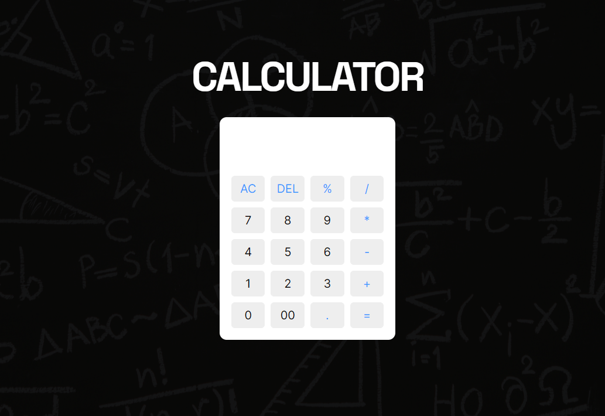

# Simple Calculator

## Description
The project is a basic calculator built using HTML, CSS, and JavaScript. It allows users to perform basic arithmetic operations.

## Features
- Simple and intuitive user interface
- Perform basic arithmetic operations
- Responsive design for various screen sizes

## Support
For support or inquiries, please contact me via:
- Email: inquery.saurav@gmail.com
- LinkedIn: [Saurav Chaturvedi](https://www.linkedin.com/in/isaurav/)

## Preview

